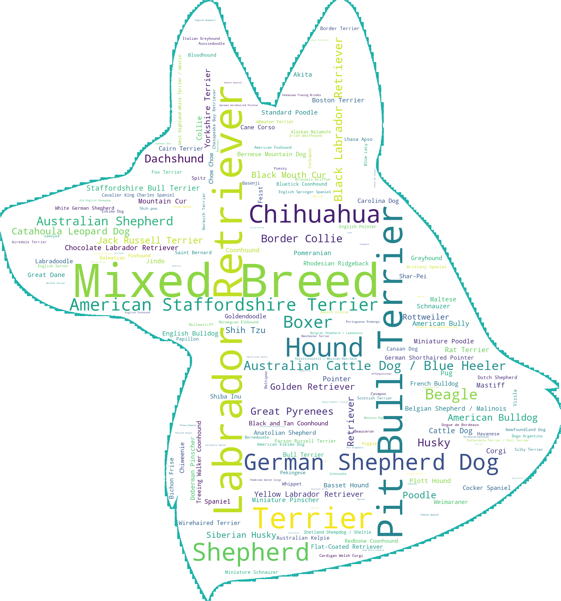

# Paws & Tales 

## Summary 
Every day, thousands of adoptable dogs are looking for new homes. Paws & Tales helps shelters and rescues put their dogs’ best paws forward. Try it here: https://pawsandtales.streamlit.app/

## Project 
Given a dog’s characteristics and biography, the app predicts whether the dog is likely to be adopted within 30 days. While certain characteristics about a dog are unchangeable – gender, breed, size, or age – shelter or rescue staff can see whether (a) the traits they choose to highlight (e.g., “playful”, “independent”, “high energy”) and (b) the biographies they write help or hurt a dog’s chances. This information could help shelters/rescues strategize for resource allocation, marketing materials, etc. 

### Data 
Pulled from [Petfinder API](https://www.petfinder.com/developers/v2/docs/) to obtain age group, size, gender, breed, and traits of 32,000+ dogs available within 100 miles of New York, NY (zip code 10001) between January and May 2023. Because exact adoption dates are not included in this dataset, days on Petfinder are inferred using the last available date for each dog. Dogs are assigned into classes based on their availability after 30 days. Short biographies of 25,000+ dogs were scraped from their individual pages and joined with data pulled from Petfinder API. The clean dataset used for training includes 26,432 dogs. 

**Some highlights from the data:**

Segmenting by age group, puppies are more likely to be adopted within 30 days compared to adult and senior dogs. 

Among 226 dog breeds present in the dataset, 17 breeds account for 56% of adoptable dogs. Dogs listed as "Mixed Breed" (without naming a specific breed) make up 15% of adoptable dogs. 

### Machine Learning 
Used scikit-learn library to build a model consisting of two steps: (1) process and extract features from data and (2) train a random forest classifier. Traits data were transformed with DictVectorizer and text data were transformed with TfidfVectorizer. Hyperparameters for TF-IDF and random forest were optimized using GridSearchCV. The model used in the app has 71% accuracy , 68% precision, and 75% recall on test data. Stepwise details on building the model are in the Jupyter notebook `model_final.ipynb` in the GitHub repo. 

## Future directions 
Ideas for improving the model and/or building a new, more granular classification model 
* use word embeddings as features for classifier 
* scikit-survival for time-to-event analysis and prediction 
* SHAP for better model explainability 

## Libraries and tools 
NumPy, pandas, matplotlib, seaborn, NLTK, scikit-learn, natural language processing (NLP), machine learning, random forest classification
